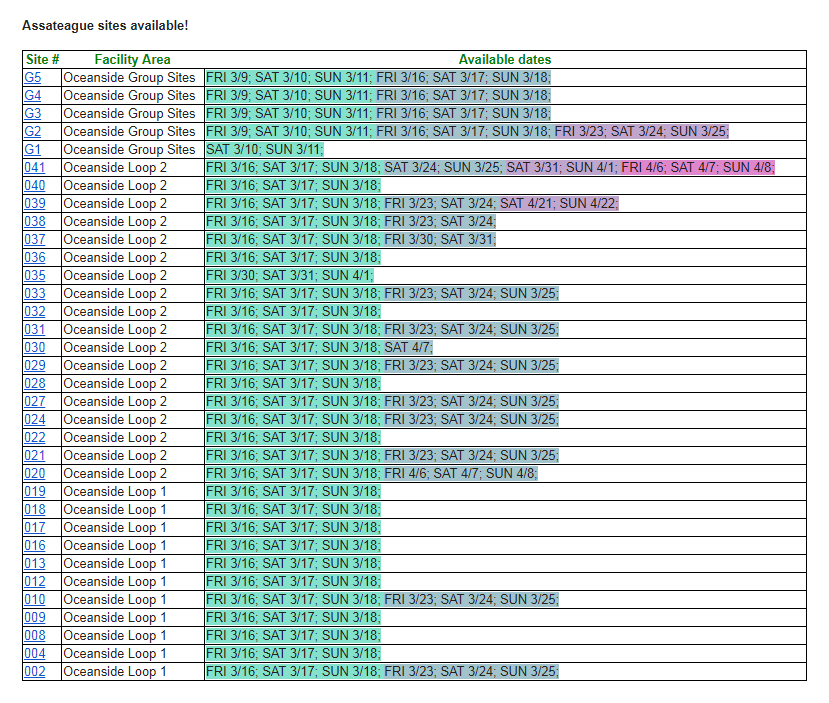

# Assateague Sites Finder
Helper code to find available sites on Assateague National Seashore. 
If you google this project then you are familiar with difficulty to find available camping spot at the summer. You should refer to [Assateague Island National Seashore campground, MD](https://www.recreation.gov/camping/assateague-island-national-seashore-campground/r/campgroundDetails.do?contractCode=NRSO&parkId=70989) quite often to find out free site. So I automated this process.
I trace available sites by desired criteria. If free spot found, email with sites availability info is sent to specified recipients. 

## Setting search criteria

Search parameters are set in [app.properties](https://github.com/sheva/assateague-sites-finder/blob/master/src/main/resources/app.properties) file.

1. Campground groups are represented in **search.campgroup.names** property, seprated by semicolon and could be *Bayside Loop A; Bayside Loop B; Bayside Loop C; Equestrian Non-Electric; Oceanside Group Sites; Oceanside Loop 1; Oceanside Loop 2; Oceanside Walk In 42-44, 51-82; Oceanside Walk In 83-104; Oceanside Walk-In 45-50*.
```
search.campgroup.names=Oceanside Group Sites; Oceanside Loop 1; Oceanside Loop 2
```
2. Desired days of week to stay stored in **search.days.of.week** property, separated by semicolon. Possible options: *[SUNDAY; MONDAY; TUESDAY; WEDNESDAY; THURSDAY; FRIDAY; SATURDAY]*.
```
search.days.of.week=FRIDAY; SATURDAY; SUNDAY
```
3. Min length of stay (in days)
```
search.length.of.stay=2
```
4. Start of period to search in (format *yyyy-MM-dd*)
```
search.start.date=2018-06-01
```
5. End of period to search in (format *yyyy-MM-dd*)
```
search.stop.date=2018-09-01
```
6. Determine whether to send notification by email or not when available sites has been found.
```
mail.send=true
```
7. Send email even if no available sites found.
```
mail.send.if.not.found=false
```


### Mail configuration

If you want to send email notifications (I am sure you want :) ) you should create **user.secret** file in [_**resource**_](https://github.com/sheva/assateague-sites-finder/blob/master/src/main/resources) directory. Please, set authentication credentials **mail.from.user** and **mail.from.password**. Also, please, mention recipients email addresses in **mail.to** property, separated by semicolon. If you do not specify **mail.to** property then recipient will be **mail.from.user**.
```
mail.from.user=
mail.from.password=
mail.to=
```
Additionally you can set javax.mail configuration properties right in that **user.secret** file. Otherwise default mail configuration properties would be taken as Gmail SMTP. So, please, be aware when setting authentication _user+password_ properties. See [**mail_default.properties**](https://github.com/sheva/assateague-sites-finder/blob/master/src/main/resources/mail_default.properties).

### How to run

After successfully configuring [app.properties](https://github.com/sheva/assateague-sites-finder/blob/master/src/main/resources/app.properties) and creating **user.secret**, you can now run **assateague-sites-finder**. 

* Run using maven:
```
$ mvn compile exec:java
```

And email with results will looks like:



That's it. I hope you will find this app quite useful for planning vacation at Assateague Seashore, MD. ;)
